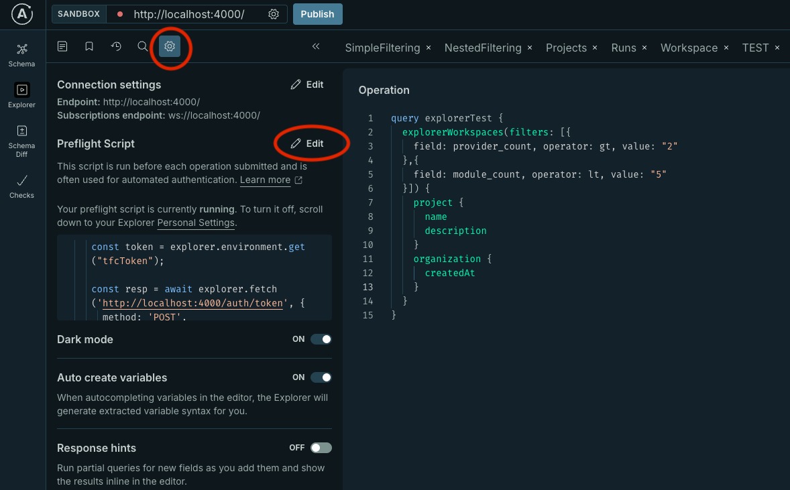

import Tabs from '@theme/Tabs';
import TabItem from '@theme/TabItem';

# Getting Started with TFGQL

Welcome to the comprehensive guide for getting started with the **TFGQL** project.

This guide will walk you through installation, configuration, and basic usage of the TFGQL API.

---

## Table of Contents

1. [Project Overview](#project-overview)
2. [Installation and Setup](#installation-and-setup)
   - [Prerequisites](#prerequisites)
   - [Clone the Repository](#clone-the-repository)
   - [Environment Variables](#environment-variables)
3. [Running the Server](#running-the-server)
4. [Exploring the API](#exploring-the-api)
5. [Basic Queries](#basic-queries)
   - [List Organizations](#list-organizations)
   - [List Teams](#list-teams)
6. [Filtering Data](#filtering-data)
7. [Nested Queries](#nested-queries)
8. [Rate Limit Handling](#rate-limit-handling)
9. [Sample Query: Workspace Runs](#sample-query-workspace-runs)
10. [Resources](#resources)

---

## Project Overview

The **TFGQL** project provides a flexible GraphQL API for interacting with Terraform Cloud and Terraform Enterprise resources, including organizations, teams, workspaces, runs, and more. It wraps the underlying REST API, exposing a strongly typed schema with advanced filtering, rate-limit handling, and streaming pagination under the hood.

:::tip
Curious how this compares to a shell script that calls the REST API?  Check out the [comparison page](Concepts/direct-vs-graphql.md)
:::

---
# No Frills Starter

<Tabs>
  <TabItem value="brew" label="Homebrew" default>
    ```bash
    brew tap jeremymefford/tfgql
    brew install tfgql
    export TFGQL_JWT_ENCRYPTION_KEY=$(openssl rand -base64 32)
    tfgql
    ```
  </TabItem>
  <TabItem value="container" label="Docker">
    ```bash
    docker pull ghcr.io/jeremymefford/tfgql:latest
    export TFGQL_JWT_ENCRYPTION_KEY=$(openssl rand -base64 32)
    docker run -p 4000:4000 ghcr.io/jeremymefford/tfgql:latest
    ```
  </TabItem>
</Tabs>

:::tip
The `TFGQL_JWT_ENCRYPTION_KEY` variable is not strictly required, but highly recommended otherwise you'll need to mint a new JWT every time you restart `tfgql`
:::

The service listens on [http://127.0.0.1:4000](http://127.0.0.1:4000) by default. Set the environment
variables in the previous section before launching (`TFGQL_JWT_ENCRYPTION_KEY`,
`TFE_BASE_URL`, etc.).

For Linux hosts download the matching binary from the
[GitHub release page](https://github.com/jeremymefford/tfgql/releases), unpack
it and run it directly. Windows users should deploy via the Docker container (no
native Windows binary is currently published).

---

## Exploring the API

Open the GraphQL Explorer at:


### [http://127.0.0.1:4000/graphql](http://127.0.0.1:4000/graphql)


Check out the [use cases](Use%20Cases/use-cases.md)
:::info
Read [this](#exchange-a-tfc-token-for-a-jwt) to learn how to setup the authentication for the requests 
in the explorer
:::

### Exchange a TFC Token for a JWT

Every GraphQL request must include a JWT issued by the server. Exchange your Terraform API token by calling the auth endpoint:

```bash
curl -X POST http://<endpoint>/auth/token \
  -H 'content-type: application/json' \
  -d '{"tfcToken":"<your terraform api token>"}'
```

The response contains an encrypted token and expiration timestamp:

```json
{ "token": "<jwe>", "expiresAt": "2025-02-07T18:21:34.000Z" }
```

Include the token in the `Authorization` header for all GraphQL calls:

```bash
curl http://<endpoint>/graphql \
  -H 'content-type: application/json' \
  -H 'authorization: Bearer <jwe>' \
  --data '{"query":"{ __typename }"}'
```

#### Apollo explorer authentication setup

##### Step 1
To use preflight scripts, you need to sign up for a free apollo dev account. Click your profile pic in the top right to start
that flow or try to save the page and it should prompt you to create or log in.

##### Step 2
Add your TFC/E token in your apollo environment


##### Step 3
Add a preflight script so the UI automatically exchanges the TFC/E token with a JWT:



:::warn
Make sure to use a stable `TFGQL_JWT_ENCRYPTION_KEY` in your local environment if using this preflight script so that your tokens are valid across restarts of the application.
:::

```js
const expiry = explorer.environment.get("jwtExpiry");

if (!expiry || Date.now() > new Date(expiry).getTime()) {
  console.log("JWT expired, fetching new one");

  const tfcToken = explorer.environment.get("tfcToken");

  const resp = await explorer.fetch('http://localhost:4000/auth/token', {
    method: 'POST',
    headers: {'content-type': 'application/json'},
    body: JSON.stringify({tfcToken})
  });


  const authResponse = await resp.json();

  explorer.environment.set("JWT", authResponse.token);
  explorer.environment.set("jwtExpiry", authResponse.expiresAt);
}
```

:::tip
Something not working with your auth?  Just delete the `jwtExpiry` variable out of your explorer env and this script will automatically generate a new JWT for you.
:::

##### Step 4
Add the `Authorization` header to each new tab


---

## Basic Queries

See [use cases](Use%20Cases/use-cases.md) for more real-world queries

<Tabs>
  <TabItem value="orgs" label="Orgs" default>
    ```graphql
      query {
        organizations {
          id
          name
        }
      }
    ```
  </TabItem>
  <TabItem value="orgs" label="Teams & Users" default>
    ```graphql
      query {
        teams(includeOrgs: ["<my-org>"]) {
          id
          name
          users {
            id
            username
          }
        }
      }
    ```
  </TabItem>
  <TabItem value="orgs" label="Workspaces" default>
  ```graphql
    query {
      workspaces(includeOrgs: ["my-org"]) {
        id
        name
        locked
        description
      }
    }
  ```
  </TabItem>
</Tabs>

---

## Filtering Data

Use the `filter` argument to narrow results. For example, fetch teams named like "ci_%":

```graphql
query {
  teams(filter: { name: { _ilike: "ci_%" } }) {
    id
    name
    organization { id }
  }
}
```

See the [Concepts](Concepts/) page for filter operators.

---

## Nested Queries

GraphQL supports nested relationships in a single request:

```graphql
query {
  organizations {
    name
    teams(filter: { name: { _ilike: "%dev%" } }) {
      name
      users(filter: { username: { _eq: "alice" } }) {
        id
        username
      }
    }
  }
}
```

:::info
Each nested resolution is only aware of the parent context.  Therefore it is not possible to do `where` style filters like "fetch all the teams that have a user named like X".

If you filter on a nested relationship, it will filter only at the nested level.  Extending the previous example, if you fetched all teams with a user filter on the users, the result will be **ALL** teams and only filtering the users.  It will not be only teams that meet the user criteria.

There are a couple custom queries that allow passing filters for different levels of resolution, but those are bespoke and cannot be broadly applied.  See this [ADR](Architecture%20Decision%20Records%20/filter-vs-where.md) if you want more info.
:::

## Resources

- [Terraform Cloud API Documentation](https://www.terraform.io/cloud-docs/api)
- [TFGQL Concepts](Concepts/)
- [Contributing Guide](Contributing/)