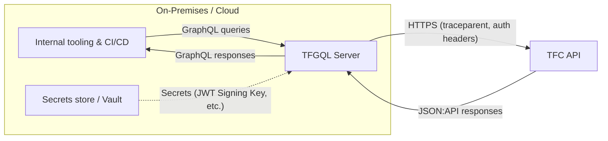
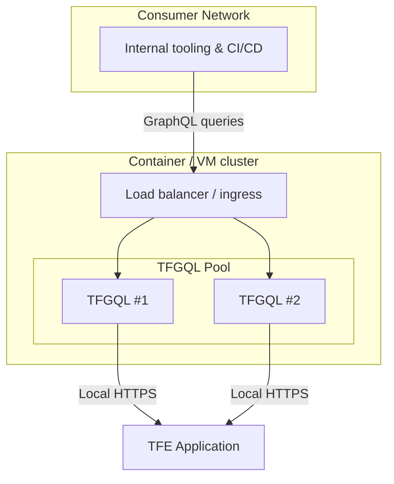
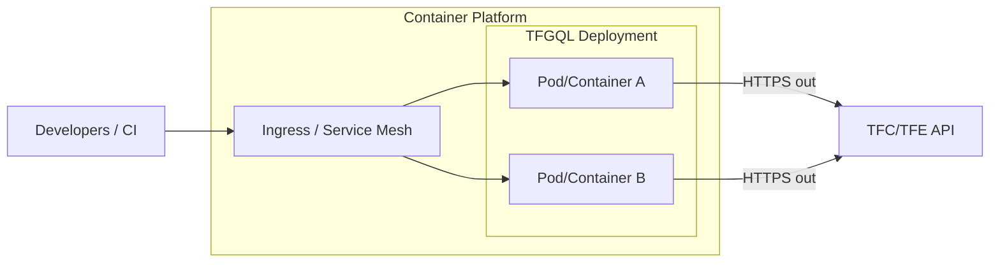

Understanding where and how to deploy the TFGQL facade helps ensure stable performance and reliable connectivity to Terraform Cloud (TFC) or Terraform Enterprise (TFE). The scenarios below outline supported network layouts and the operational considerations that come with each option.

There is no SaaS option for TFGQL, so you must host it yourself.

## TFGQL to Terraform Cloud (TFC)

When calling TFC, you can host it in your on-premises datacenters or in a public cloud tenant. The application only needs network access to TFC's APIs.

- Place the service close to the systems issuing GraphQL queries to reduce latency and avoid exposing internal tooling to the public Internet.
- Allow outbound HTTPS to `https://app.terraform.io/api/v2` (or your configured base URL).
- Ensure persistent storage for the AES key so encrypted JWTs remain valid across restarts and horizontally scaled replicas.

## On-Premises TFGQL to Terraform Enterprise

When Terraform runs are hosted in your own TFE instance, TFGQL remains a thin facade over the TFE API. You may colocate the service alongside TFE if the node has spare capacity, but heavy usage warrants a dedicated runtime.

- Running TFGQL inside the same Docker runtime as TFE works for light usage, but large or unbounded queries can consume significant memory because TFE pagination is handled in-memory. Prefer a separate node group or container workload when high concurrency is expected.
- Keep the service within the same low-latency network segment as TFE to avoid performance regressions when streaming paginated responses.

## Runtime & Platform Considerations

TFGQL is stateless, making it well-suited to container orchestrators such as Kubernetes or OpenShift. A standard deployment pattern includes:

- **Stable encryption key**: When running behind a load balancer, configure the `TFGQL_JWT_ENCRYPTION_KEY` with the same value across all replicas. A rotating or pod-scoped key prevents clients from reusing JWTs when requests land on different instances.
- **Horizontal scaling**: Increase replicas to match peak concurrency; the service has no shared in-memory cache, so scaling out is linear provided each pod keeps the AES key and configuration in sync.
- **Operational visibility**: Maintain log aggregation that captures the AsyncLocalStorage-enriched fields (`trace_id`, `span_id`) for request tracing across the load balancer and upstream API.

By selecting the topology that matches your Terraform control plane (cloud or enterprise) and adhering to the runtime guidance above, you can run the TFGQL server with predictable latency and operational reliability.
